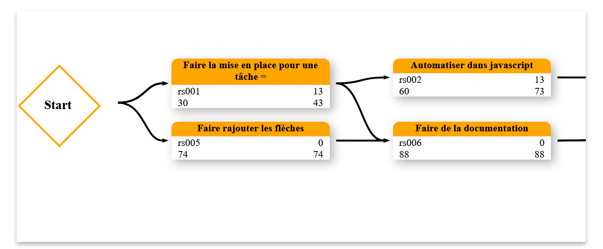
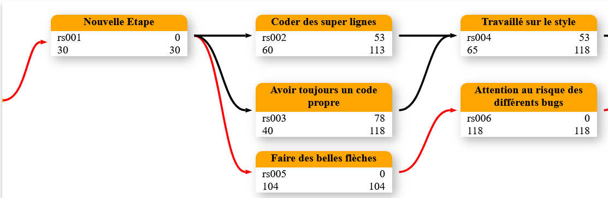

# 📌 The PERT Diagram

## 🧠 What is the PERT Diagram?

The **PERT diagram** (Program Evaluation and Review Technique) is a project management tool that allows for **planning, organizing, and coordinating tasks** within a project. It is an **oriented graph** that represents the various **activities** (or tasks) of a project and their **logical sequence**.

> This diagram was developed in the 1950s for the U.S. Navy (Polaris project 🚀).

---

## 🎯 What is it used for?

The PERT diagram is used to:

* **Visualize the structure of a project** in the form of a network.
* **Identify the critical path** (Critical Path) 🛣️, i.e., the sequence of activities that determines **the minimum duration of the project**.
* **Identify dependencies** between tasks.
* **Estimate completion times**.
* **Detect margins of maneuver** on certain activities (called *margins* or *floats*).

---

## 🛠️ Tool

This JavaScript library aims to create a PERT diagram quickly and intuitively.



---

## 🔎 Implementation

```html
<div id="PERT-container" class="PERT-container">
  <div id="svg-container" style="position: absolute; top: 0; left: 0; z-index: 1;"></div>
  <div id="task-container" style="position: absolute; top: 0; left: 0; z-index: 2;"></div>
</div>

<script>
  document.addEventListener("DOMContentLoaded", () => {
    const data_pert = {
      A : {
        id: "rs001",
        title: "Set up for a task =",
        duree: 30,
        mother : ["Start"],
      },
      B : {
        id: "rs002",
        title: "Automate in JavaScript",
        duree: 30,
        mother : ["A"],
      },
      C : {
        id: "rs003",
        title: "Set up Dags",
        duree: 10,
        mother : ["B"],
      },
      D : {
        id: "rs004",
        title: "Correct display of position",
        duree: 5,
        mother : ["C", "A"]
      },
      E : {
        id: "rs005",
        title: "Add arrows",
        duree: 74,
        mother : ["Start"],
      },
      F : {
        id: "rs006",
        title: "Create documentation",
        duree: 14,
        mother : ["A", "E"],
      },
      J : {
        id: "rs008",
        title: "Push to git",
        duree: 13,
        mother : ["D", "F"],
      }
    }

    const specificDate = new Date('2023-10-05');
    const pert = new PERT(specificDate);
    const chaine = pert.printPERT(data_pert);
  });
</script>
```

There is also the possibility of adding critical paths in red.



## Next Steps

- Add a view with a classic PERT diagram  
- Add a view showing the progress of each task


# 📌 Le Diagramme de PERT

## 🧠 Qu'est-ce que le diagramme de PERT ?

Le **diagramme de PERT** (Program Evaluation and Review Technique) est un outil de gestion de projet qui permet de **planifier, organiser et coordonner des tâches** dans un projet. Il s'agit d'un **graphe orienté** qui représente les différentes **activités** (ou tâches) d’un projet et leur **enchaînement logique**.

> Ce diagramme a été développé dans les années 1950 pour la marine américaine (projet Polaris 🚀).

---

## 🎯 À quoi sert-il ?

Le diagramme de PERT est utilisé pour :

* **Visualiser la structure d’un projet** sous forme de réseau.
* **Identifier le chemin critique** (Critical Path) 🛣️, c’est-à-dire la suite d’activités qui détermine **la durée minimale du projet**.
* **Repérer les dépendances** entre les tâches.
* **Estimer les délais** de réalisation.
* **Détecter les marges de manœuvre** sur certaines activités (appelées *marges* ou *flottements*).


---

## 🛠️ Outil

Cette bibliothèque javascript a pour objectif de créer un diagramme PERT de façon rapide est intuitif.


---

## 🔎 Mise en place

```html
<div id="PERT-conteneur" class="PERT-conteneur">
  <div id="svg-container" style="position: absolute; top: 0; left: 0; z-index: 1;"></div>
  <div id="task-container" style="position: absolute; top: 0; left: 0; z-index: 2;"></div>
</div>

<script>
  document.addEventListener("DOMContentLoaded", () => {
    const data_pert = {
      A : {
        id: "rs001",
        title: "Faire la mise en place pour une tâche =",
        duree: 30,
        mother : ["Start"],
        },
      B : {
        id: "rs002",
        title: "Automatiser dans javascript",
        duree: 30,
        mother : ["A"],
      },
      C : {
        id: "rs003",
        title: "Mettre en place Dags",
        duree: 10,
        mother : ["B"],
      },
      D : {
        id: "rs004",
        title: "Affichage correct de la posisition",
        duree: 5,
        mother : ["C", "A"]
      },
      E : {
        id: "rs005",
        title: "Faire rajouter les flèches",
        duree: 74,
        mother : ["Start"],
      },
      F : {
        id: "rs006",
        title: "Faire de la documentation",
        duree: 14,
        mother : ["A", "E"],
      },
      J : {
        id: "rs008",
        title: "Mettre sur git",
        duree: 13,
        mother : ["D", "F"],
      }
    }
      
    const specificDate = new Date('2023-10-05');
    const pert = new PERT(specificDate);
    const chaine = pert.printPERT(data_pert);
  });
  </script>
```

Il y a aussi la possibilité de rajouter les chemins critiques en rouge. 


## Prochaines étapes

- Ajouter une vue avec un diagramme de PERT classique  
- Ajouter une vue affichant l’avancement de chaque tâche